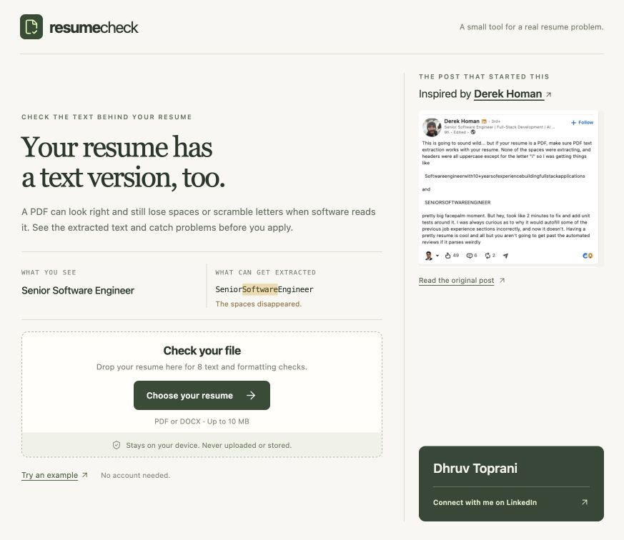
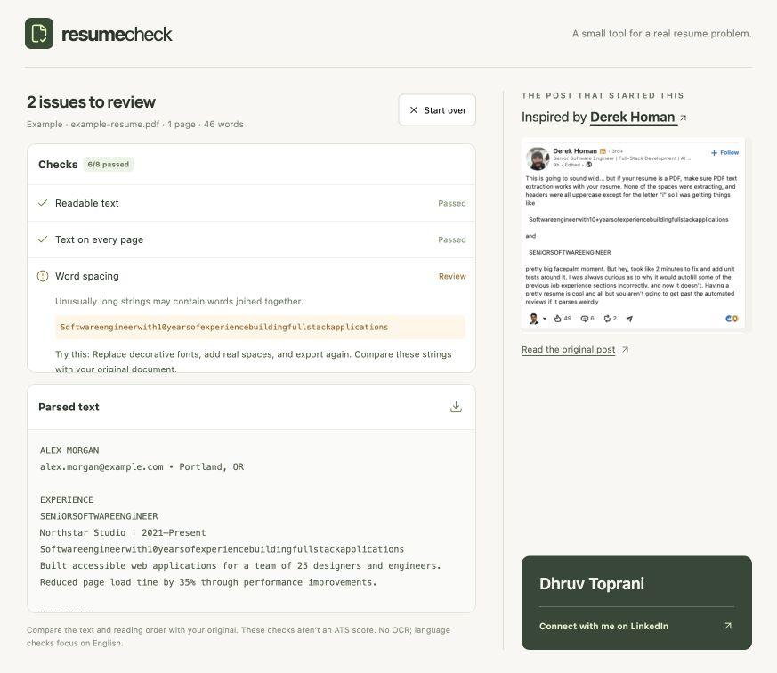
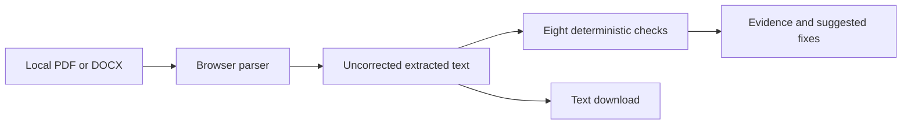

# Resume Check

[](https://get-resumecheck.vercel.app)
[](#privacy)
[](https://vite.dev/)

**Your resume has a text version, too.**

Upload a PDF or DOCX to see its extracted text, run eight parsing checks, and get specific fixes for missing spaces, broken characters, and unreadable content. Everything runs on your device.

**Links:** [Live product](https://get-resumecheck.vercel.app) · [The checks](#eight-parsing-checks) · [Run locally](#run-locally) · [Limitations](#limitations) · [Connect with Dhruv](https://www.linkedin.com/in/dhruvtoprani/)



## Problem

A resume can look correct in a PDF viewer while the underlying text contains joined words, unexpected letter casing, or missing sections. Those defects can affect software that extracts text for application forms or document processing.

Resume Check makes that text visible. It preserves the parser output instead of quietly repairing the very defects you need to inspect. It does not predict hiring outcomes or produce an ATS score.

## The Experience

1. Choose or drop a PDF or Word document.
2. Read its extracted text beside the checks.
3. Expand flagged checks for evidence and suggested fixes.
4. Download the text, update the source document, and check the new export.

The example uses a fictional resume with intentional spacing and casing defects.



## Eight Parsing Checks

| Check | Looks for |
| --- | --- |
| Readable text | Too little extractable text |
| Text on every page | PDF pages with little or no text |
| Word spacing | Unusually long strings that may contain joined words |
| Character encoding | Replacement, control, or private-use characters |
| Unexpected letter case | Lowercase letters inside uppercase words |
| Split-up letters | Runs of individually spaced letters |
| Contact email | An email address in the extracted text |
| Section headings | Recognizable standalone English section labels |

Each check is a heuristic. A flag means **review**, not that the document is definitely wrong. Checks that depend on readable text are skipped when there is not enough text to evaluate.

## Architecture



- **UI:** Vanilla JavaScript, CSS, Lucide icons, Vite.
- **PDF:** PDF.js with its compatibility build, bundled worker, fonts, character maps, and decoding assets.
- **Word:** Mammoth raw-text extraction. No document HTML is rendered.
- **Checks:** Pure JavaScript functions, covered by Node's test runner.
- **Hosting:** Static Vercel deployment. No backend or API keys.

PDF text streams are consumed through `getReader()` rather than async iteration to support Safari versions affected by [PDF.js issue #21557](https://github.com/mozilla/pdf.js/issues/21557).

## Privacy

Resume contents stay in browser memory. The app has no upload endpoint, accounts, analytics, database, or persistent resume storage. Text is inserted as text, never executed as HTML. Clearing the file removes the displayed results; reloading also clears the session.

The site still loads its static resources and Google Fonts over the network. Following the attribution or creator links opens LinkedIn. Neither action sends the resume contents.

## Run Locally

Requirements: Node.js 22.13+ and npm.

```bash
git clone https://github.com/dhruvtoprani/resume-check.git
cd resume-check
npm ci
npm run dev
```

Open `http://localhost:5173`. No environment variables are required. The predev and prebuild scripts copy PDF support assets from the installed package.

## Verification

```bash
npm test
npm run build
npm run preview
```

The 16 unit tests cover clean text, joined words, broken encoding, casing, letter spacing, email detection, sparse pages, error messages, and stream-reader compatibility. Local browser checks covered PDF/DOCX uploads, malformed and blank PDFs, downloads, sample/reset, responsive layout, and extraction with stream async iteration disabled.

A ready-to-enable GitHub Actions template is provided at `docs/ci.yml`. Move it to `.github/workflows/ci.yml` using a credential with workflow permission to run installation, the unit suite, and a production build on pushes and pull requests.

## Repository Map

```text
src/main.js             Interface and local file handling
src/checks.js           Eight checks and fictional sample
src/pdf-text.js         Compatible PDF text stream reader
src/errors.js           User-facing parser diagnostics
src/*.test.js           Unit and regression tests
src/style.css           Responsive layout
scripts/pdf-assets.js   Copies PDF support assets during setup/build
public/                 Favicon and attributed post screenshot
docs/assets/            Product screenshots
docs/ci.yml             Ready-to-enable CI workflow
```

## Deployment

Vercel builds with `npm run build` and serves `dist/`. The public address is [get-resumecheck.vercel.app](https://get-resumecheck.vercel.app). Generated PDF assets, dependencies, local credentials, and build output are excluded from Git.

## Limitations

- Files are limited to 10 MB; PDFs are limited to 30 pages.
- No OCR: scanned/image-only resumes need text recognition first.
- Word documents are treated as one text document; their visual pagination is not recovered.
- Different parsers can return different text. This does not reproduce any specific employer's ATS.
- Heading and word-pattern checks focus on English. Reading order, omissions, and other languages still need manual review.
- Passing all checks is not a resume-quality score or a guarantee of successful applications.

## Inspiration and Credits

Inspired by [Derek Homan](https://www.linkedin.com/in/derek-homan/) and [his original post about PDF resume extraction](https://www.linkedin.com/feed/update/urn:li:activity:7507873916422561793/). The displayed screenshot is credited to him; its inclusion does not imply endorsement.

Built entirely with AI under the direction of [Dhruv Toprani](https://www.linkedin.com/in/dhruvtoprani/).
